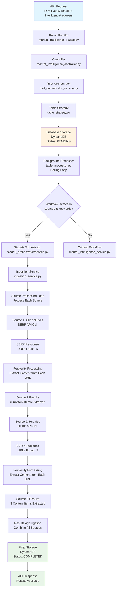
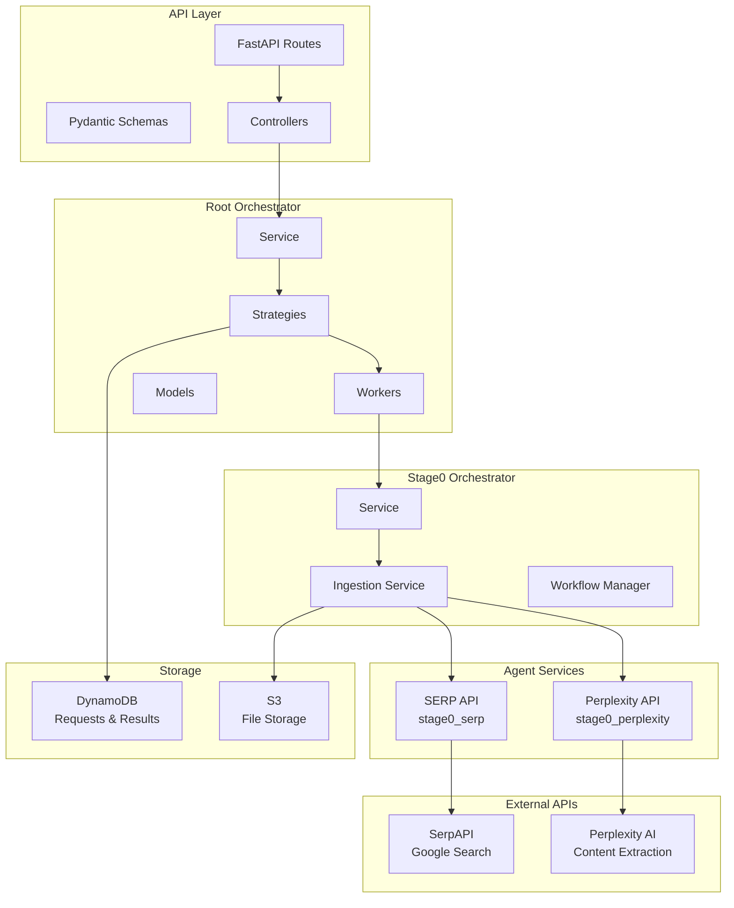
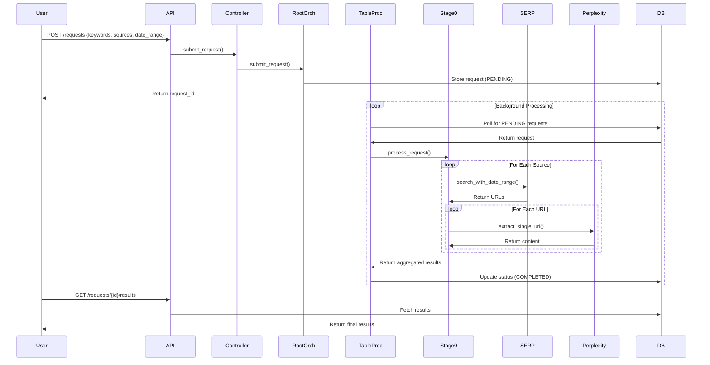

# Visual Workflow Diagram

## 🎯 Complete SERP-Perplexity Workflow



## 🔄 Data Transformation Flow

```mermaid
graph LR
    A[Your Request<br/>{keywords, sources, date_range}] --> B[Schema Validation<br/>SubmitRequestSchema]
    B --> C[MarketIntelligenceRequest<br/>Object Creation]
    C --> D[Database Storage<br/>JSON Format]
    D --> E[Background Processing<br/>Object Reconstruction]
    E --> F[Stage0 Conversion<br/>Format Mapping]
    F --> G[SERP Query Building<br/>Google Search Format]
    G --> H[Perplexity Processing<br/>Content Extraction]
    H --> I[Results Aggregation<br/>Final Response]
```

## 📊 Processing Timeline

```mermaid
gantt
    title SERP-Perplexity Processing Timeline
    dateFormat X
    axisFormat %Ss
    
    section API Layer
    Request Received    :done, api, 0, 1s
    Schema Validation   :done, schema, 0, 1s
    Database Storage    :done, db, 1s, 2s
    
    section Background Processing
    Request Detection   :done, detect, 2s, 3s
    Workflow Selection  :done, workflow, 3s, 4s
    
    section Source 1 (ClinicalTrials)
    SERP API Call      :done, serp1, 4s, 6s
    URLs Found (5)     :done, urls1, 6s, 7s
    Perplexity Calls   :done, perp1, 7s, 12s
    Content Extracted  :done, content1, 12s, 13s
    
    section Source 2 (PubMed)
    SERP API Call      :done, serp2, 13s, 15s
    URLs Found (3)     :done, urls2, 15s, 16s
    Perplexity Calls   :done, perp2, 16s, 20s
    Content Extracted  :done, content2, 20s, 21s
    
    section Finalization
    Results Aggregation :done, agg, 21s, 22s
    Final Storage      :done, final, 22s, 23s
```

## 🏗️ System Architecture



## 🔍 Component Interaction Details

